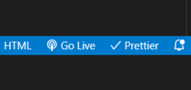

# Bounce It! 🟠

**Bounce It**, is an exciting casual game on both mobile and web platforms. Your objective is to guide a ball through a variety of obstacles and challenges. With its simple yet highly addictive gameplay, _Bounce It_ appeals to both new and experienced gamers.

## Overview 📖

**Bounce It**, is a captivating casual game accessible on both mobile and web platforms. Your primary mission is to deftly navigate a bouncing ball through various obstacles and challenging scenarios, aiming for an endpoint thus leading to success.

## Features 🚀

- **Canvas:** This defines a bitmapped area in an HTML page. The Canvas API allows JavaScript to draw graphics on the canvas.
- **Map Data:** An array representing the map tiles. Each number corresponds to a key.
- **Key Variables**:
  - **id** - An integer that corresponds with a tile in the data array.
  - **color** - Any javascript-compatible color variable.
  - **solid** - Whether the tile is solid or not, defaults to false.
  - **bounce** - How much velocity is preserved upon hitting the tile, 0.5 is half.
  - **jump** - Whether the player can jump while over the tile, defaults to false.
  - **friction** - friction of the tile, must have _X_ and _Y_ values.
  - **gravity** - gravity of the tile, must have X and Y values.
  - **fore** - whether the tile is drawn before the player, defaults to false.
  - **script** - refers to a script in the scripts section, executed if it is touched.

## How to Play 🎮

1. When you launch the game, your initial screen is the Home page.
2. On the Home page, you'll find two distinct buttons: **Start Game** and **Instructions**.
3. Selecting _Start Game_ will navigate you to the game interface, while _Instructions_ provides essential insights into the game's rules.
4. The game is composed of _three_ challenging levels that players must conquer.
5. For movement control, use the left and right arrow keys, and employ the up arrow key to make your character jump.
6. When confronted with **Red** tiles, proceed with caution, as they have the potential to terminate your game prematurely.
7. Upon successfully reaching the endpoint, signified by a **Yellow** tile, you will progress to the next level.
8. Upon reaching the _Third level_, the final stage, successful completion will return you to the Home page.
9. During gameplay, a _timer_ and _scoreboard_ will be prominently displayed, allowing you to track your performance.

## Setup and Installation ⚙️

1. Clone this repository: `git clone https://github.com/Bounce-It/Bounce_It.git`
2. Open the `index.html` file in Visual Studio and run the file.
3. Open a web browser and go to `http://127.0.0.1:5500/` to play the game.
4. Game Link: `https://bounceit.netlify.app/#`, you can also access the game through this link.

## Run Locally

Clone the project

```bash
  git clone https://github.com/Bounce-It/Bounce_It.git
```

Go to the project directory

```bash
  cd Bounce_It
```

Start the server



```bash
  Click 'Go Live' shown in the above Snapshot, in your Visual Studio Editor.
```

## Tech Stack 🛠

**HTML/CSS:** For structuring and styling the game interface.

**JavaScript:** For enhancing interactivity and features.

## Third-Party Assets </>

1. **jQuery:** jQuery is a fast, small, and feature-rich JavaScript library. It makes things like HTML document traversal and manipulation, event handling, animation, and Ajax much simpler with an easy-to-use API that works across a multitude of browsers.

_Code Snippet_:

```bash
  <script src="https://code.jquery.com/jquery-3.7.1.min.js"></script>
```

2. **Sweet Alert 2:** This API allows us to create custom alert boxes.

_Code Snippet_:

```bash
    <script src="https://cdn.jsdelivr.net/npm/sweetalert2@11.4.8/dist/sweetalert2.all.min.js"></script>
```

```bash
scripts:{
next_level:
 "Swal.fire({icon: 'success', title: 'Successful', text: 'Redirecting to Level 2!', confirmButtonText: 'Next Level'}).then((result) => {if(result.isConfirmed){window.location.href = '/Level2.html'}})",
death:
 "Swal.fire({icon: 'error', title: 'You Died!', text: 'Reloading the same Level!', showConfirmButton: false, timer: 2000}); this.load_map(map);"
}
```

3. **Icons8:** This website allows to download logos.

```bash
<link rel="icon" type="image" href="/logo.png"/>
```

4. **FontsGet:** This website allows us to select custom Fonts.

```bash
@font-face {
  font-family: game;
  src: url(Squirk.otf); /*Change the Source URL to change font*/
}
```

5. **ColorSpace**: Color Palettes Generator and Color Gradient Tool.

## Contributors 🤝

- [Prateek Choudavarpu](https://github.com/prateek10201)
- [Shubham Pardeshi](https://github.com/Shubham-2110)
- [Manikanta](https://github.com/manikanta799)

## Links 🔗

🟠 [Game Link](https://bounceit.netlify.app/)

